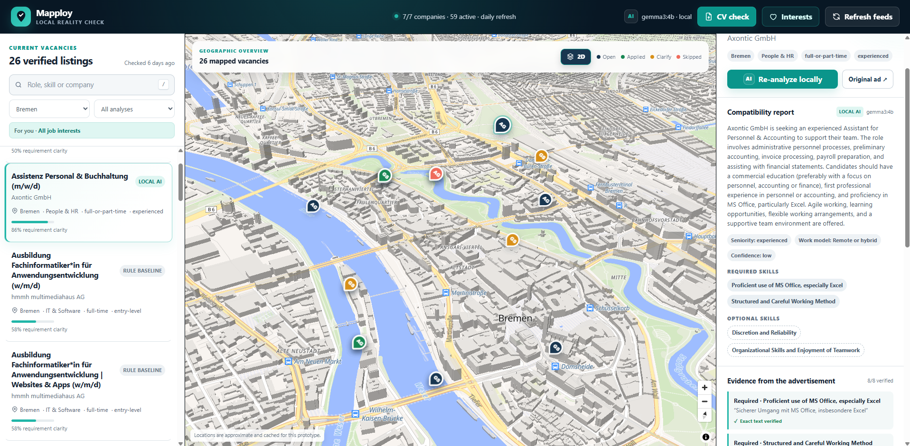
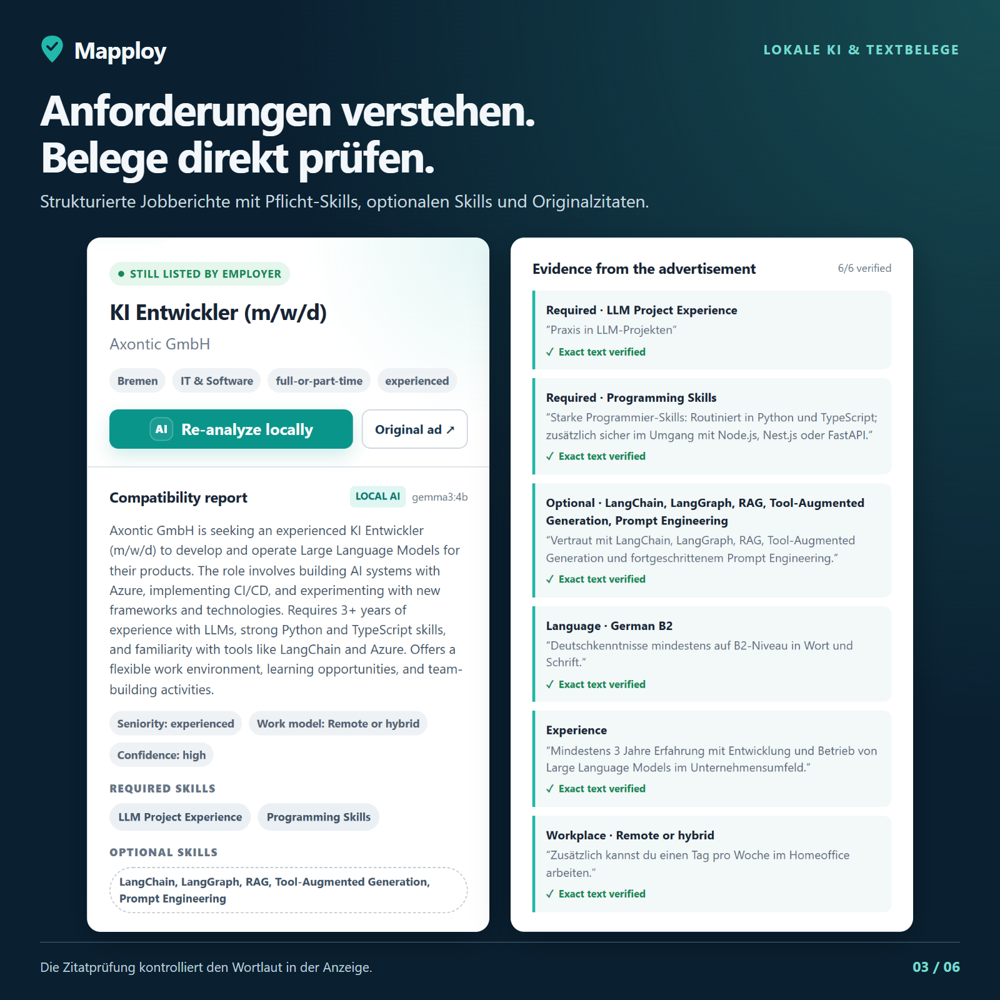
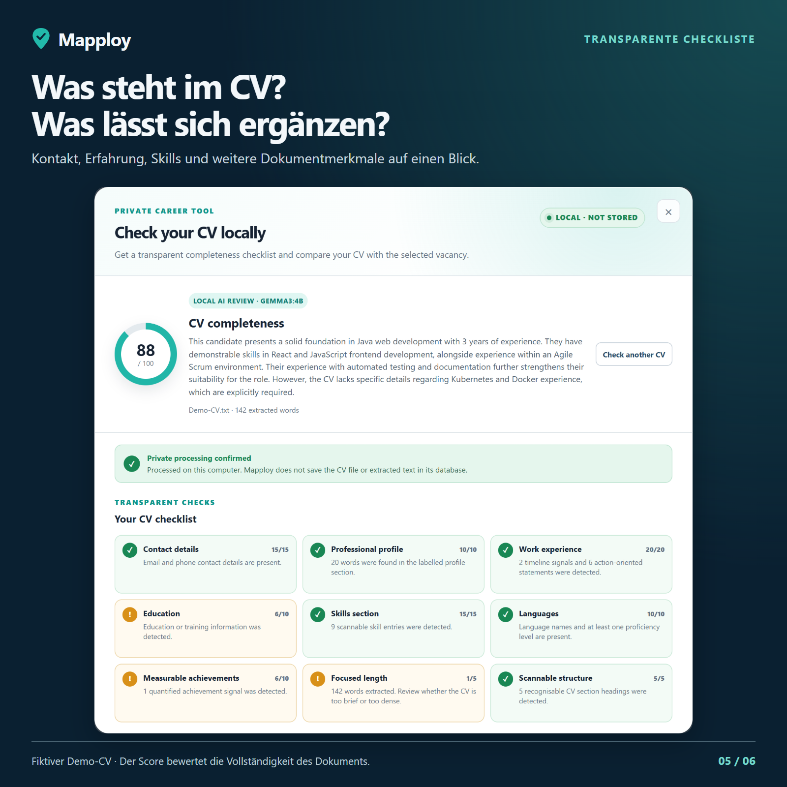
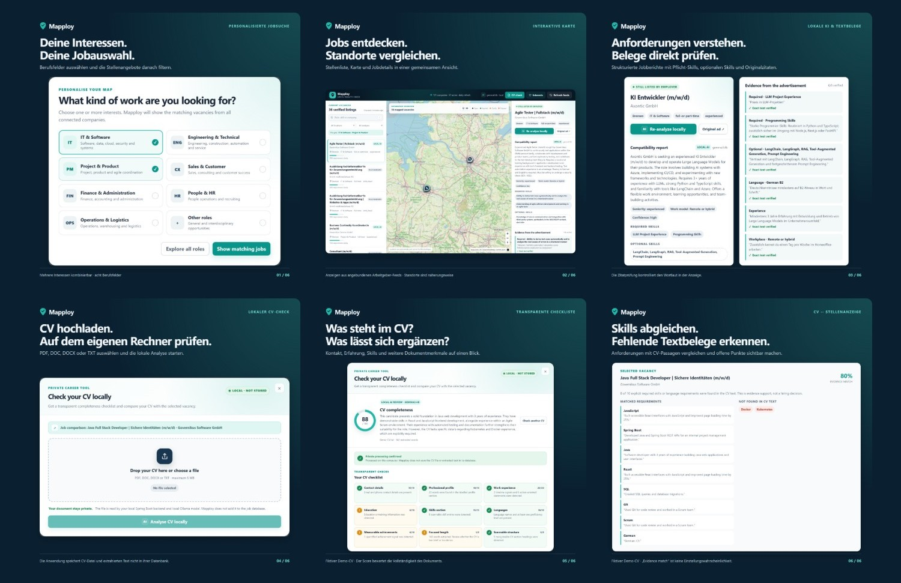
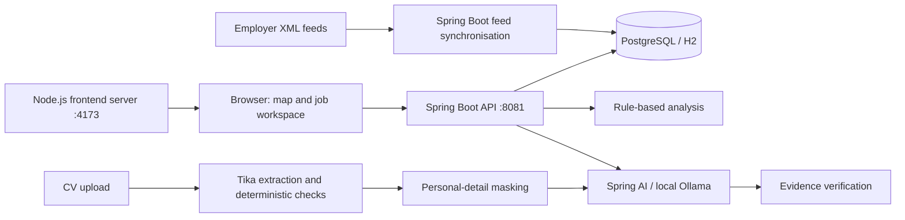

# Mapploy

**Find jobs on a map. Understand requirements. Review your CV locally.**

Mapploy is a student prototype that brings employer job feeds, an interactive map and local AI analysis into one workspace. It focuses on vacancies in Bremen, Hamburg and remote roles, with filters for different professional interests.



## Features

- **Job discovery:** search vacancies from seven configured Personio employer feeds, filter by location and interests, and open the original advertisement.
- **Interactive map:** explore approximate job locations with MapLibre, including a 3D view and markers for your saved application decisions.
- **Feed tracking:** refresh daily, keep first/last-seen timestamps and retire listings after three successful feed checks in which they are missing.
- **Local job analysis:** extract required and optional skills, languages, experience and unclear information with Spring AI and Ollama. A rule-based baseline is available without a model.
- **Source evidence:** check whether quoted evidence occurs in the original advertisement after text normalisation. This checks the quotation, not whether the model interpreted it correctly.
- **CV review:** process PDF, DOC, DOCX or TXT files locally, show a transparent completeness checklist and compare explicit requirements with CV text. Recognised personal details are masked before the optional local model review.
- **Your decisions:** mark jobs as applied, to clarify or skipped; interests and decisions are saved in your browser.

<p align="center">
  
  
</p>

### Feature overview

[](docs/images/feature-overview.jpg)

The 3D screenshot was supplied for this portfolio; the feature captures are from 3 October 2026. Vacancies and counts are snapshots; the CV example is fictional. See [screenshot notes](docs/images/README.md).

## Technology

| Layer | Stack |
| --- | --- |
| Frontend | JavaScript modules, HTML, CSS, MapLibre GL JS |
| Frontend server | Node.js |
| Backend | Java 25, Spring Boot 4.1.1, Spring Data JPA |
| Local AI | Spring AI 2.0.1, Ollama, Gemma 3 4B |
| Storage | PostgreSQL 17, Flyway; H2 for local development |
| Document extraction | Apache Tika |
| Verification | JUnit / Spring Boot tests, JavaScript syntax checks |

## Quick start

Install **JDK 25**, **Node.js 22 or newer with npm**, and optionally **Ollama** for local AI. Dependencies, employer feeds and map tiles require internet access; AI processing uses the configured local Ollama instance.

```bash
git clone https://github.com/KasemRRash/mapploy.git
cd mapploy
```

### Windows launcher

With Ollama installed, download the model once:

```bash
ollama pull gemma3:4b
```

Then run from **Git Bash on Windows**:

```bash
bash start-mapploy.sh
```

The launcher starts Ollama, the backend with an H2 database and the frontend, then opens **http://127.0.0.1:4173**. It reuses running services and keeps them running after the terminal closes. See [launcher details](START-MAPPLOY.md).

### Manual start (Windows, Linux or macOS)

Ensure `JAVA_HOME` points to JDK 25. Start the backend in one terminal:

```bash
cd backend
# Linux/macOS:
./mvnw spring-boot:run -Dspring-boot.run.profiles=dev
# Windows PowerShell, instead:
.\mvnw.cmd spring-boot:run '-Dspring-boot.run.profiles=dev'
```

Start the frontend in a second terminal:

```bash
cd prototype
npm ci
npm start
```

Open **http://127.0.0.1:4173**. Rule-based job reports and deterministic CV checks work without Ollama. To enable AI, run `ollama serve` if it is not already running and install `gemma3:4b` with `ollama pull gemma3:4b`.

For PostgreSQL, run `docker compose up -d postgres` inside `backend/`, then start the backend without the `dev` profile. The Compose database uses port **5433** and local development credentials. Configuration and API endpoints are documented in [backend/README.md](backend/README.md).

## Architecture



The UI calls the Spring backend on port 8081. The Node server also retains the earlier prototype API and its separate feed cache for reference; the current UI uses the Spring backend. See [frontend notes](prototype/README.md).

## Verification

```bash
cd prototype
npm ci
npm run check
```

```bash
cd backend
./mvnw test
# Windows: .\mvnw.cmd test
```

The backend tests cover feed parsing, job categorisation, analysis evidence, CV extraction, checklist behaviour, personal-detail masking and the CV model/output privacy boundary. Tests use synthetic identities and do not require a running Ollama server or PostgreSQL database. GitHub Actions runs the backend tests and frontend syntax checks on pushes and pull requests.

## Scope and limitations

Mapploy was developed as an AI-assisted student project. It is a local prototype, with a fixed set of employer feeds, approximate map coordinates and no accounts or production deployment setup.

Uploaded CV files and extracted CV text are not persisted by the CV services. Masking is pattern-based and can miss unusual names or layouts; it is not guaranteed anonymisation. Job data is stored locally, while the browser contacts external map providers. Keep the backend and Ollama local when processing personal documents.

AI summaries can be wrong even when a quoted fragment is present. CV completeness and requirement-match scores describe document content, not employability or hiring probability. Review the original advertisement and keep the final application decision with the user.

Job content belongs to the respective employers; map attribution remains visible in the UI and screenshots. This repository contains source code, documentation and selected demonstration images. Local databases, private CVs, logs, generated reports and workshop materials are excluded.
